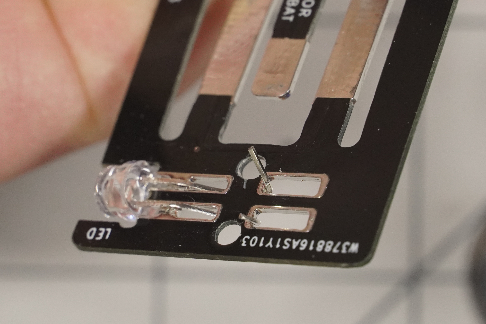

### Assembly instructions:

Build Video: https://www.youtube.com/watch?v=3N0H6gIqDZk

Orientation: Positive (typically long lead) towards the bottom. Battery negetive facing up, will be in contact with top fork.

Thread through two contact pads. Can be helpful to pre-bend leads in opposite direction beforehand. Can even use circular holes to help.

Bend, secure, cut as needed. Test.

Apply heat shrink.

All done!

 
