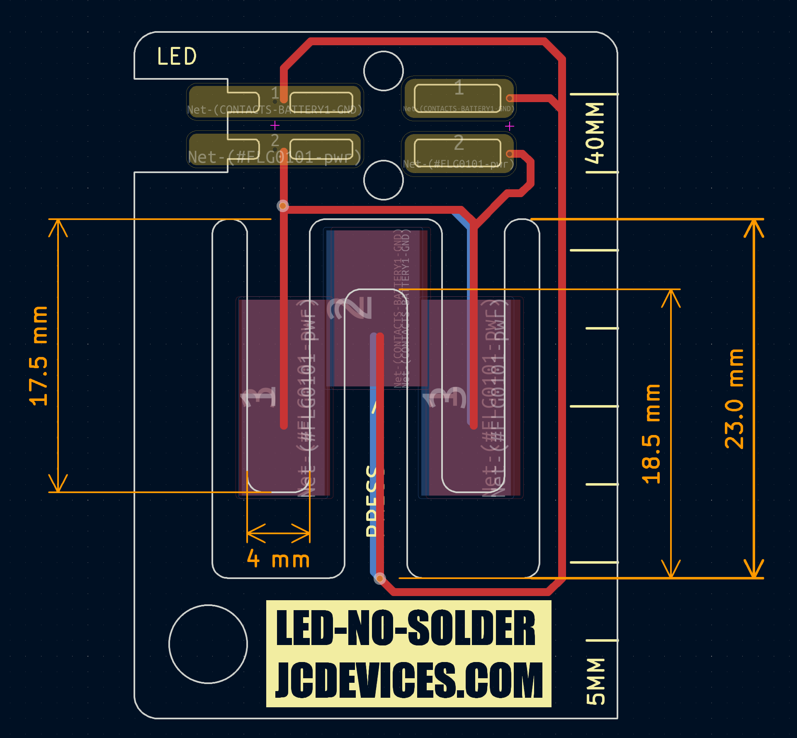

# LED-No-Solder
.8mm PCB that includes coin cell holder and LED that can be attached with no solder  
Available on Tindie: https://www.tindie.com/products/jeremycook/led-no-solder-3-pack/  
Build video: https://www.youtube.com/watch?v=3N0H6gIqDZk

 
